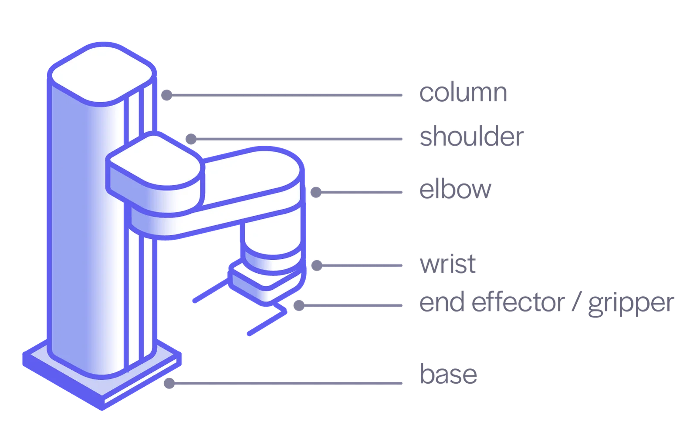

# SCARA 로봇 기구학 모델 (SCARA Robot Kinematic Model)

## 목적

조립체·부품 명명은 이 문서의 SCARA 기구학 모델을 기준으로 맞춘다.
기구학 모델은 **관절(joint)**, **축(axis)**, **링크(link)**, **실존 부품(parts)**을 분리해서 표현한다.

## 참조 이미지




## 기구학 연결 모델

`*_JOINT`는 두 링크를 연결하는 기구학적 관절이다.
`*_AXIS`는 해당 관절의 병진 방향 또는 회전 중심선이다.
`*_LINK`는 같은 관절 상태에서 함께 움직이는 추상 rigid body이다.

```text
VERTICAL_JOINT (J1) connects BASE_LINK -> CARRIAGE_LINK
  type: prismatic
  axis: VERTICAL_AXIS

SHOULDER_JOINT (J2) connects CARRIAGE_LINK -> UPPER_ARM_LINK
  type: revolute
  axis: SHOULDER_AXIS

ELBOW_JOINT (J3) connects UPPER_ARM_LINK -> FOREARM_LINK
  type: revolute
  axis: ELBOW_AXIS

WRIST_JOINT (J4) connects FOREARM_LINK -> TOOL_LINK
  type: revolute
  axis: WRIST_AXIS
```

## 링크와 실존 부품

실제 OpenSCAD 부품·조립체 이름은 각 링크의 `parts`로 둔다.
부품명은 반드시 추상 링크명과 1:1로 대응하지 않아도 된다.

```text
BASE_LINK
├─ printed parts:
│  ├─ BASE_DRIVE_END_PLATE
│  ├─ BASE_UPPER_LEADSCREW_SUPPORT_PLATE
│  └─ BASE_LOWER_LEADSCREW_SUPPORT_PLATE
├─ vitamins:
│  ├─ GUIDE_RODS
│  ├─ LEADSCREW
│  ├─ FLANGE_COUPLINGS
│  ├─ FLANGE_BEARING_BLOCKS
│  ├─ STEPPER_MOTOR
│  └─ SHAFT_COUPLING
└─ VERTICAL_JOINT (J1, type: prismatic, axis: VERTICAL_AXIS) -> CARRIAGE_LINK
   ├─ printed parts:
   │  ├─ VERTICAL_CARRIAGE_PLATE
   │  └─ SHOULDER_MOUNT
   ├─ vitamins:
   │  ├─ LINEAR_BEARINGS
   │  └─ LEADNUT
   └─ SHOULDER_JOINT (J2, type: revolute, axis: SHOULDER_AXIS) -> UPPER_ARM_LINK
      ├─ parts: UPPER_ARM
      └─ ELBOW_JOINT (J3, type: revolute, axis: ELBOW_AXIS) -> FOREARM_LINK
         ├─ parts: FOREARM
         └─ WRIST_JOINT (J4, type: revolute, axis: WRIST_AXIS) -> TOOL_LINK
            └─ parts: WRIST_HOUSING, TOOL_FLANGE
```

## 표준 조인트 체결

J2부터 말단까지의 회전 관절은 같은 `STANDARD_JOINT_HUB`와 `STANDARD_JOINT_MOUNT`를 쓴다.
링크 모듈은 이 체결 기준을 따라야 하며, 개별 부품 형상은 이 기준을 깨지 않는 범위에서 바꿀 수 있다.

```text
STANDARD_JOINT_HUB
  applies to: SHOULDER_JOINT (J2), ELBOW_JOINT (J3), WRIST_JOINT (J4)
  role: 회전축을 중심으로 인접 링크를 정렬하고 M3 인서트 체결로 토크를 전달한다.
  features: circular flange, inner-race centering boss, straight keyed pilot boss, symmetric M3 brass insert pattern, axis bore

STANDARD_JOINT_MOUNT
  applies to: UPPER_ARM_LINK, FOREARM_LINK, TOOL_LINK
  role: 링크 모듈 쪽에서 STANDARD_JOINT_HUB를 받아 정렬하고 체결한다.
  features: keyed pilot socket, matching screw clearance holes, M3 screw head counterbores, M6 axis fastener relief, axis bore
```

회전 관절의 `joint hub`는 **standard modular joint flange**로 본다.
즉, 축·베어링·풀리와 링크 모듈 사이에서 동심 정렬, 체결, 방향 기준을 제공하는 표준 인터페이스 부품이다.
외곽은 360도 회전 여유를 해치지 않도록 원형으로 유지하고, 방향 기준은 `keyed pilot boss`와 `keyed pilot socket`의 맞물림으로 강제한다.
허브 쪽 체결 홀은 M3 heat-set brass insert용 블라인드 홀로 두고, 마운트 쪽은 M3 캡스크류 관통 홀과 스크류 머리 카운터보어를 둔다.
스크류 머리는 기본적으로 허브 접촉면의 반대쪽에 묻히도록 배치해 허브 플랜지와 마운트 면이 직접 맞닿게 한다.
숄더 볼트 머리와 락너트용 카운터보어는 표준 허브에 두지 않는다.
M6 숄더 볼트와 락너트는 허브의 축 스택을 직접 조이고, `STANDARD_JOINT_MOUNT`는 socket side 중앙에 `axis fastener relief`를 두어 이 체결부를 피한다.
허브 내측면의 `inner-race centering boss`는 608 내륜만 접촉하도록 하여, 축방향 클램프가 외륜이나 파츠 포켓으로 전달되지 않게 한다.

실존 파츠 기준은 아래 파일에 둔다.

```text
parts/joint_hub.scad  J2부터 말단까지 공유하는 양면 STANDARD_JOINT_HUB
parts/joint_mount.scad  링크 모듈 쪽에서 허브를 받는 STANDARD_JOINT_MOUNT
```

## 피벗 방향

링크의 양끝은 기준부에 가까운 쪽을 `proximal pivot`(근위 피벗), 말단부에 가까운 쪽을 `distal pivot`(원위 피벗)으로 부른다.

```text
[proximal pivot] ── link body ── [distal pivot]
[근위 피벗]        ── 링크 몸체 ──  [원위 피벗]
```

## 용어집

| 용어 | 의미 | 사용 기준 |
|---|---|---|
| `joint` | 두 링크를 연결하고 상대 운동을 허용하는 기구학적 관절 | 연결 관계를 표현할 때 사용한다. |
| `axis` | 관절의 병진 방향 또는 회전 중심선 | 운동 방향이나 회전선을 표현할 때 사용한다. |
| `link` | 같은 관절 상태에서 함께 움직이는 추상 rigid body | 로봇 기구학 모델의 운동 단위로 사용한다. |
| `parts` | 실제 OpenSCAD 부품 또는 조립체 | CAD 파일, 출력 부품, 브래킷, 판재, 샤프트 등에 사용한다. |
| `prismatic` | 직선 병진 관절 | `VERTICAL_JOINT (J1)`에 사용한다. |
| `revolute` | 회전 관절 | `SHOULDER_JOINT`, `ELBOW_JOINT`, `WRIST_JOINT`에 사용한다. |
| `STANDARD_JOINT_HUB` | J2부터 말단까지 공유하는 표준 조인트 허브 | 양면 허브, inner-race centering boss, straight keyed pilot boss, M3 인서트 패턴, 축 보어에 사용한다. |
| `STANDARD_JOINT_MOUNT` | 링크 모듈 쪽의 표준 조인트 마운트 | keyed pilot socket, M3 관통 홀, M3 카운터보어, M6 축 체결부 회피 포켓에 사용한다. |
| `joint hub` | 회전 관절축 주변의 모듈 교환용 표준 플랜지 | 축·베어링·풀리와 링크 모듈을 정렬하고 볼트로 체결한다. |
| `joint mount` | `joint hub`와 체결되는 링크 쪽 수용부 | 링크 모듈이 표준 허브와 호환되도록 하는 장착부이다. |
| `inner-race centering boss` | 608 내륜만 누르는 허브 중앙 보스 | 허브와 베어링 사이 간격을 만들고, 축방향 조임력이 외륜으로 흐르지 않게 한다. |
| `keyed pilot boss` | 방향 키가 붙은 직선 센터링 보스 | 허브가 올바른 각도일 때만 마운트 소켓에 들어가도록 한다. |
| `keyed pilot socket` | 방향 키 형상을 받는 여유 있는 센터링 소켓 | 링크 모듈 쪽에서 허브의 방향과 중심을 동시에 맞춘다. FDM 출력 여유, 입구 relief, 코너 relief를 둔다. |
| `brass insert hole` | M3 heat-set brass insert를 받는 허브 쪽 블라인드 홀 | 나사산을 출력물에 직접 만들지 않고 인서트로 반복 조립성을 확보한다. |
| `counterbore` | 스크류 머리를 묻히는 원통형 자리 | 마운트 바깥쪽에서 캡스크류 머리가 돌출되거나 접촉면에 끼지 않도록 한다. |
| `axis fastener relief` | M6 숄더 볼트 머리 또는 락너트를 피하는 마운트 중앙 포켓 | 허브와 축 체결부가 먼저 성립하고, 마운트는 그 주변에서 허브에 체결되도록 한다. |
| `BASE_LINK` | 고정 기준 링크 | 베이스 판, 기둥, 리니어 가이드 등 고정부를 포함한다. |
| `CARRIAGE_LINK` | 수직 리니어 관절을 따라 움직이는 캐리지 링크 | 암 캐리지와 어깨 마운트 구조를 포함한다. |
| `UPPER_ARM_LINK` | 어깨 관절 이후 함께 회전하는 상완 링크 | 상완 링크와 관련 구동 부품을 포함한다. |
| `FOREARM_LINK` | 팔꿈치 관절 이후 함께 회전하는 전완 링크 | 전완 링크와 관련 구동 부품을 포함한다. |
| `TOOL_LINK` | 손목 관절 이후 함께 회전하는 말단 링크 | 손목 하우징과 툴 플랜지를 포함한다. |
| `proximal pivot` | 기준부에 가까운 피벗 | 링크의 베이스 쪽 끝을 가리킨다. |
| `distal pivot` | 말단부에 가까운 피벗 | 링크의 툴 쪽 끝을 가리킨다. |
